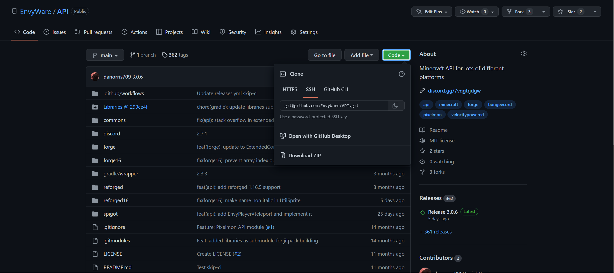

# Pixelmon MDK [](https://discord.gg/7vqgtrjDGw) [](https://www.gnu.org/licenses/lgpl-3.0.html)

This repository serves as an example for how to create a Pixelmon sidemod
using Forge 1.20.2 and Pixelmon's 9.X.X API.

If you have any unanswered questions after reading through this README then
please join my Discord and ask your questions in the [developer channel](https://discord.gg/7vqgtrjDGw).


<!-- TOC -->
* Pixelmon MDK
  * [Getting Started](#getting-started)
    * [Download](#download)
    * [Clone](#clone)
    * [Editting the MDK](#editing-the-mdk)
    * [Testing](#testing)
    * [Building](#building)
    * [Updating Pixelmon](#updating-pixelmon)
  * [FAQ](#faq)
  * [Creating commands](#commands)
  * [Listeners](#listeners)
  * [EnvyAPI](#envyapi)
<!-- TOC -->

## Getting Started
To get started first clone this repository, or download the contents, to a 
folder where you want to work. 

### Download
To download the repository click the green "Code" button and then press "Download ZIP".
As seen below:



### Cloning
To clone the repository please follow the instructions [here](https://git-scm.com/book/en/v2/Git-Basics-Getting-a-Git-Repository)
under "Cloning an Existing Repository".

### Editing the MDK
Once you have the decompressed files in your workspace open the folder using IntelliJ.

Make sure to replace all "examplemod" references with the ID of your mod. When creating the mod ID please ensure
that it is all lower case and only contains alphanumeric characters (otherwise Forge/Minecraft will refuse to load it)

You should also change all "your.domain.path" references (and folder names) to the
packaging of your choice. You should own the domain that you're using and if not
a common practice is using `me.yournamehere.`.

#### Testing
If you want to run your mod in the Minecraft game without having to run a server then follow the steps below.

1. Run the ForgeGradle task`genIntelliJRuns` 
2. Go to the drop down in the top right of IntelliJ


3. Click the runClient entry from the drop down
4. Click the red bug on the right to run the game

Once you've pressed the red button (to the right of the green triangle) it may take a couple
of minutes before IntellIJ runs the Minecraft client. This is normal as it is downloading the Pixelmon client
and checking all the files for Mojang mappings so that it can run in your development environment.

After a couple of minutes you should find that your mod has loaded in a Minecraft client. You can now
enter a single player world and interact with your mod as normal.


#### Building
Once you have edited the above you're ready to go! To then compile your mod
you should use the `./gradlew build` command which will produce a JAR file
in the `releases` folder with a version number appended to the end.

Make sure to update your version number for each release you do!

#### Updating Pixelmon
If the version of Pixelmon available in this is out of date then make sure to follow these steps to update it to the latest.

1. Find your way to the [build.gradle](build.gradle) file
2. Once in that file look for the "dependencies" section. Which looks like this:

3. Then replace the "9.2.1" with the current version of the mod (in both places!)

## FAQ
Frequently Asked Questions

### Why do I want a version number at the end of the JAR name?
This makes it easier for end users to determine which version of the 
mod they are currently running. If you're looking for a jar without
any version numbers look in the `build/libs/` directory

### How do I run in debug
I usually don't run my mods in the Forge `runClient` so unfortunately I
am not much help in offering support there. When I am debugging/testing
I usually add logger lines to determine what variables contain what values,
or where the logic has reached at that point.

If someone else can explain how to make runClient work with a sidemod I am
more than happy to put the explanation above.

## Commands
To create commands using Mojang's Brigadier I recommend you read through
their documentation [here](https://github.com/Mojang/brigadier/blob/master/README.md)

I have my own API for commands. If you're looking for examples of how to 
use that I'd suggest looking through the [bingo](https://github.com/EnvyWare/ReforgedBingo) sidemod I have made.

There is now two examples of commands in the MDK 
- https://github.com/EnvyWare/Pixelmon-MDK/blob/main/src/main/java/your/domain/path/command/ExampleCommand.java
- https://github.com/EnvyWare/Pixelmon-MDK/blob/main/src/main/java/your/domain/path/command/MoreComplicatedCommand.java

Both of these demonstrate how you can use Brigadier to create server side commands (all commands are server side in 1.20.2).
The second example shows a more complicated example with arguments and also gives an example of how to use the PokemonSpecification (spec) system.

## Configs
To create configs I recommend using Pixelmon's internal config API, which is the same as the config API in the EnvyWare API.
The config API is just a small wrapper around Sponge's Configurate, and allows for very easy config reloading and simple config
design from a code perspective. 
You can find an example of how to use it [here](https://github.com/EnvyWare/Pixelmon-MDK/blob/main/src/main/java/your/domain/path/config/ExampleConfig.java)

## Listeners
In the project you can find an example Pixelmon listener. However, below I'll
include an example for TCG, Pixelmon and Forge.

Mod class:
```java
@SubscribeEvent
public static void onServerStarting(FMLServerStartingEvent event) {
    GenericEventListener eventListener = new GenericEventListener();
    MinecraftForge.EVENT_BUS.register(eventListener);
    Pixelmon.EVENT_BUS.register(eventListener);
    TCG.EVENT_BUS.register(eventListener);
}
```

GenericEventListener class:
```java
public static class GenericEventListener {
    
    @SubscribeEvent
    public void onPlayerLoggedIn(PlayerLoggedInEvent event) {
        
    }
    
    @SubscribeEvent
    public void onTCGEvent(TCGEvent event) {
        
    }
    
    @SubscribeEvent
    public void onEggHatch(EggHatchEvent.Pre event) {
        
    }
}
```

## EnvyAPI

If you're looking for an example of how to use my API please look at
any of the sidemods on this GitHub organization.
